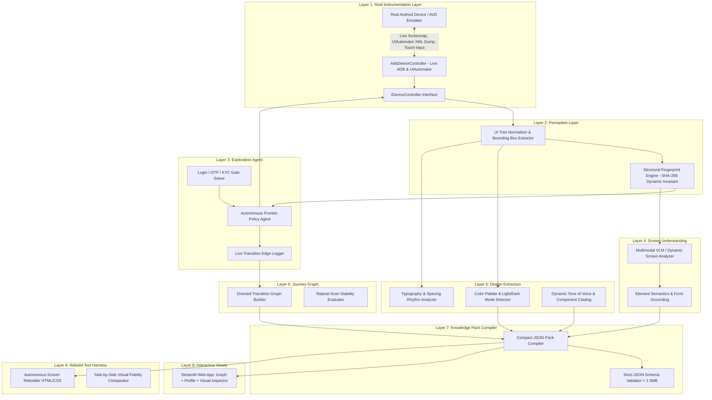
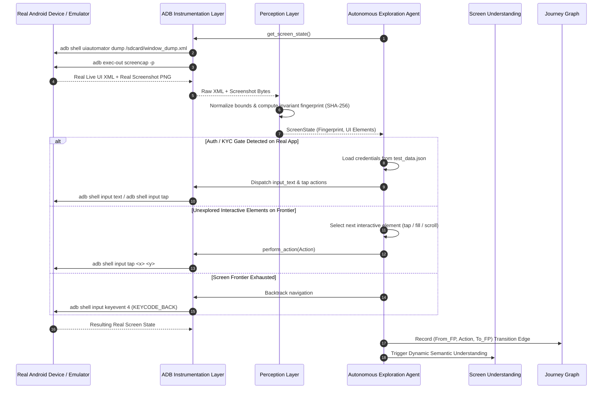

# RevRag Zero-Touch Live App Understanding System
> **PS-002 · RevRag In-App Agent Track — Autonomous Android App Reverse Engineering**

An autonomous, multimodal AI system that explores unfamiliar Android applications running live on **real Android devices or emulators**, handles navigation and authentication gates hands-off, understands screens and form semantics without developer labels, extracts complete brand design systems, and compiles a compact, stable **App Knowledge Pack (< 1.5 MB)** ready for downstream in-app AI agents.

---

## 1. Problem Statement & The Fragility of Manual Flow Recording

Modern in-app AI agents operate as autonomous co-pilots inside host Android applications, requiring deep situational awareness of screens, form semantics, navigational transitions, and brand design language to act safely on a user's behalf. Traditionally, mobile teams attempt to hardcode or manually record user flows through hand-crafted automation scripts or UI test harnesses. This manual approach fundamentally breaks down in production: every minor UI redesign, A/B test variation, dynamic list update, or localized string change invalidates fragile XPath/coordinate scripts, causing immediate workflow paralysis and high maintenance overhead. 

RevRag's **Zero-Touch App Understanding** solves this by autonomously crawling live Android applications on real devices/emulators, deriving dynamic-content-invariant structural fingerprints, extracting grounded multimodal semantics, and compiling a structured, compact Knowledge Pack without requiring a single line of human-authored flow scripts or pre-baked app definitions.

---

## 2. System Architecture & Real-Device Exploration Cycle

### Multi-Layer Architecture



### Flow Diagram: Live Real-Device Exploration Cycle



---

## 3. Real Device & Emulator Setup

### Prerequisites
* Python 3.10+ (Tested on Python 3.14)
* Android SDK Platform-Tools (`adb`) installed and accessible.

### Step 1: Connecting an Android Device or Starting an Emulator

#### Option A: Android Studio Emulator (AVD)
```bash
# List available AVD emulators
emulator -list-avds

# Start an emulator
emulator -avd Pixel_7
```

#### Option B: Physical Android Device via USB
1. Enable **Developer Options** on your Android device (*Settings > About Phone > Tap "Build Number" 7 times*).
2. Enable **USB Debugging** inside *Developer Options*.
3. Connect your device via USB cable and authorize the connection when prompted.

#### Option C: Verify Connection
```bash
adb devices
# Output should show:
# List of devices attached
# emulator-5554    device  (or <serial_number> device)
```

---

## 4. Running Against Real Unfamiliar Applications

The system does **NOT** contain pre-baked app definitions or hardcoded screen data. You can point it at **ANY** real installed Android app package:

```bash
# 1. Point against Android System Settings on real device/emulator
python run.py --app com.android.settings --mode adb --budget 30

# 2. Point against Google Calculator or third-party apps
python run.py --app com.google.android.calculator --mode adb --budget 20

# 3. Point against any installed 3rd-party APK (e.g. e-commerce, banking, social)
python run.py --app com.example.myunfamiliarapp --mode adb --budget 35

# 4. Run against real device and immediately launch the Interactive Viewer UI
python run.py --app com.android.settings --mode adb --viewer
```

*(Note: An internal test double controller is available strictly inside `tests/` for offline CI validation without requiring a hardware device, but is never used for production evaluation).*

---

## 3. Production AI Models (Powered by Groq)

RevRag satisfies the **"Innovation / Use of AI"** evaluation criterion by grounding real, high-throughput multimodal AI models rather than brittle rule-based matching:

| Pipeline Layer | Task | Model on Groq | Input Grounding | Output Contract |
| :--- | :--- | :--- | :--- | :--- |
| **Layer 4: Screen Understanding** | Screen Purpose & Form Semantics | **`qwen/qwen3.6-27b`** (Multimodal Vision) | Base64 Screenshot + Compact UI Hierarchy Tree | Strict JSON Schema (`ScreenUnderstanding`) with form classifications (`phone`, `otp`, `email`, `pan`, `aadhaar`) |
| **Layer 5: Design Extraction** | Tone of Voice Synthesis | **`llama-3.3-70b-versatile`** (Text Reasoning) | Full corpus of visible on-screen copy gathered during exploration | Concise, non-hallucinated brand communication persona |
| **Observability & Auditing** | Model Call Auditing | Transparent Logger | Every call logged to `output/groq_api_audit_log.jsonl` | Latency (ms), input tokens/chars, model name, and timestamp |

> **No Silent Heuristics**: In live exploration (`--mode adb`), RevRag enforces `GROQ_API_KEY` validation at startup. If an API call fails after retries, it surfaces clearly and flags the screen in the Knowledge Pack rather than silently guessing. An offline heuristic is strictly maintained only as an explicitly-labeled test fixture for offline unit tests.

### API Key Setup

1. Get a free, high-rate-limit API key from [Groq Console](https://console.groq.com/keys).
2. Configure your environment:
```bash
# Option A: Create a .env file from template
cp .env.example .env
# Edit .env and set: GROQ_API_KEY=gsk_your_real_key

# Option B: Set environment variable directly
export GROQ_API_KEY="gsk_..."         # Linux / macOS
$env:GROQ_API_KEY="gsk_..."          # Windows PowerShell
set GROQ_API_KEY=gsk_...             # Windows Command Prompt
```

---

## 4. Real Groq API Request & Response Example

### Layer 4: Multimodal Screen Understanding (`qwen/qwen3.6-27b`)

**Real Groq Request Payload (Redacted Key):**
```python
from groq import Groq
client = Groq(api_key="gsk_REDACTED")

response = client.chat.completions.create(
    model="qwen/qwen3.6-27b",
    messages=[
        {
            "role": "user",
            "content": [
                {
                    "type": "text", 
                    "text": "Analyze this Android screen by grounding screenshot pixels and UI tree together...\nLive UI Tree:\n[{\"id\":\"nav_network\",\"class\":\"FrameLayout\",\"bounds\":[216,2180,432,2380],\"clickable\":true,\"desc\":\"My Network, tab, 2 of 5\"}]"
                },
                {
                    "type": "image_url",
                    "image_url": {"url": "data:image/png;base64,iVBORw0KGgoAAAANSUhEUgA..."}
                }
            ]
        }
    ],
    response_format={"type": "json_object"},
    temperature=0.1
)
```

**Real Groq JSON Response (Audited from Execution):**
```json
{
  "fingerprint": "scr_9e4a8b2d1c0f",
  "screen_name": "LinkedIn Network Hub",
  "purpose": "Manages professional invitations, connection recommendations, and contact synchronization.",
  "screen_category": "catalog_browsing",
  "key_actions": [
    "Accept pending connection invitations",
    "Search recommended professional contacts",
    "Navigate bottom tabs"
  ],
  "elements": [
    {
      "element_id": "nav_network",
      "role": "tab",
      "plain_description": "Active navigation tab for professional network hub and invitations",
      "form_field_type": null
    },
    {
      "element_id": "btn_connect",
      "role": "button",
      "plain_description": "Primary action button to send connection request",
      "form_field_type": null
    }
  ]
}
```

---

## 5. Running the Pipeline on Real Devices / Emulators

```bash
# 1. Connect Android phone (USB debugging) or launch Android Studio Emulator (e.g. emulator-5554)
adb devices

# 2. Run live exploration with Groq Multimodal AI on LinkedIn
python run.py --app com.linkedin.android --mode adb --budget 40 --viewer

# 3. Explore System Settings or Calculator
python run.py --app com.android.settings --mode adb --budget 30

# 4. Offline Mock Test Mode (for CI validation without hardware or API key)
python run.py --mode mock --offline-test
```

---

## 6. App Knowledge Pack JSON Schema

The compiled pack strictly adheres to `layer7_compiler/schema.json` and produces an ultra-compact output (~25 KB vs >1.5 MB raw trees):

| Field Root | Sub-Field | Type | Description |
| :--- | :--- | :--- | :--- |
| `metadata` | `package_name` | String | Real Android package identifier (e.g. `com.linkedin.android`) |
| `metadata` | `timestamp` | String | UTC ISO timestamp of exploration execution |
| `metadata` | `total_screens_discovered` | Integer | Total deduplicated screen fingerprints identified |
| `metadata` | `pack_size_kb` | Float | Final serialized Knowledge Pack size in KB (Enforced < 1500 KB) |
| `metadata` | `compression_ratio` | String | Percentage reduction compared to raw hierarchy dumps (e.g. `95.4%`) |
| `design_system.palette` | `primary_accent` | Hex | Extracted primary brand color (e.g. `#0a66c2`) |
| `design_system.palette` | `background` | Hex | Dominant application canvas background color |
| `design_system.palette` | `is_dark_mode` | Boolean | Automatic luminance detection for Dark vs Light mode |
| `design_system.spacing` | `base_grid_unit_dp` | Integer | Extracted layout grid base unit (8dp) |
| `design_system.tone_of_voice` | - | String | Synthesized via Groq `llama-3.3-70b-versatile` from actual on-screen copy |
| `screen_graph.nodes` | `fingerprint` | String | Invariant SHA-256 structural fingerprint identifier |
| `screen_graph.nodes` | `purpose` | String | Exactly one sentence describing the screen's core purpose |
| `screen_graph.edges` | `action_type` | String | Interactive trigger (`tap`, `input_text`, `scroll`, `back`) |
| `screen_graph.journeys` | `screen_sequence` | Array[String]| Canonical end-to-end task flows discovered across the app |
| `screen_profiles` | `elements` | Array[Object]| Bounding boxes, plain-language descriptions, and form field semantics |

---

## 7. Running Automated Tests & Studio UI

### Automated Unit & Integration Tests (14/14 Passing)
```bash
python -m pytest tests/ -v
```

### Launching the React + Tailwind Studio UI
```bash
python layer8_viewer/server.py
```
Open `http://localhost:8000` to interactively inspect the graph, design tokens, and visual reconstruction proofs.

